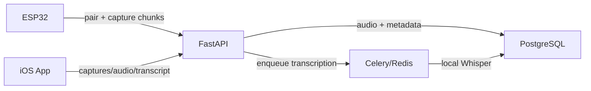

# SecondMind Backend (Device Direct DB Upload)

Production-oriented backend + app pairing foundation for ESP32 device direct audio upload into PostgreSQL, local transcription, and app playback.

## Live Context & Tracker
- Detailed project tracker: `REDBY.md`
- API contract freeze: `docs/api_contract_v1_freeze.md`

## Stack
- FastAPI (API)
- PostgreSQL (captures/transcripts)
- Redis + Celery (async transcription)
- faster-whisper (self-hosted STT)
- Docker Compose (runtime)

## High-Level Flow


## Current Feature Tracker

| Feature | Status |
|---|---|
| BLE pairing (app <-> ESP32 <-> backend) | Done |
| Continuous chunk upload (ping-pong buffers) | Done |
| Rolling auto-finalize session upload | Done |
| DB-stored WAV playback via API | Done |
| Local faster-whisper transcription worker | Done |
| Retry + stale-session recovery for transcription | Done |
| Self-hosted Whisper model path support | Done |

## Quick Start
1. Create env file:
```bash
cp .env.example .env
```
2. Start stack:
```bash
docker compose up --build
```
3. API base URL:
```text
http://localhost:8000/v1
```

## Self-Hosted Whisper Model (Recommended)
Use your own local Whisper model files so transcription does not depend on runtime model fetches.

1. Download model once into shared Docker model volume:
```bash
docker compose run --rm api python scripts/download_whisper_model.py --model-size small --output-dir /models
```
2. Set in `.env`:
```env
WHISPER_MODEL_PATH=/models/faster-whisper-small
```
3. Restart worker:
```bash
docker compose up -d worker
```

## Core Endpoints
- `GET /v1/health`
- `POST /v1/app/register`
- `POST /v1/app/auth`
- `GET /v1/app/devices`
- `GET /v1/app/captures`
- `GET /v1/app/captures/{session_id}/audio`
- `GET /v1/app/captures/{session_id}/transcript`
- `POST /v1/device/register` (requires `X-Admin-Key`)
- `POST /v1/device/auth`
- `POST /v1/device/capture/sessions`
- `POST /v1/device/capture/chunks`
- `POST /v1/device/capture/sessions/{session_id}/finalize`
- `POST /v1/pairing/start`
- `POST /v1/device/pairing/complete`

## Team Guides
- IoT: `docs/iot_pairing_guide.md`
- BLE gateway: `docs/ble_phone_gateway_flow.md`
- App pairing API: `docs/app_pairing_api_flow.md`
- Deployment: `docs/cloudflare_tunnel_deploy_hamza.md`
- Firmware: `firmware/arduino_ide/SecondMindESP32S3/README_ARDUINO.md`

## Notes
- Capture and transcript schema are DB-first for reliable retrieval.
- For long-term production lifecycle management, keep using migrations and retention policies.
