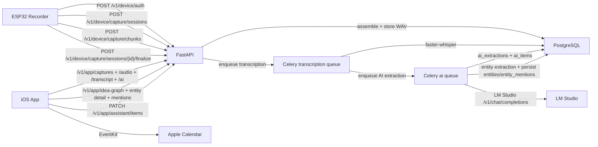

# CortX (SecondMind) — Voice Memory Assistant

CortX is a full-stack voice memory system:
- ESP32 captures conversation audio and uploads it to backend.
- Backend stores audio in PostgreSQL, transcribes locally with Whisper, and runs AI extraction via LM Studio.
- iOS app shows each conversation as a memory card with transcript, intent, tasks, reminders, and Apple Calendar actions.

## What Is Implemented (Current)

### 1) Firmware + Device Ingestion
- Device registration and auth with backend JWT.
- Pairing flow (BLE token transfer + backend pairing APIs).
- Continuous chunk capture pipeline:
  - `start session` -> `upload ordered chunks` -> `finalize session`.
- Compatibility full WAV upload endpoint still supported.
- Chunk ordering and duplicate handling (ack/next sequence semantics).

### 2) Backend Capture + Storage
- FastAPI v1 API for app/device/pairing/health.
- PostgreSQL as primary store for:
  - capture sessions
  - audio chunks
  - finalized WAV blob
  - transcripts
  - AI extraction results and actionable items
- Finalization assembler converts ordered chunks into final WAV.

### 3) Transcription Worker
- Celery worker queue for transcription.
- Local `faster-whisper` support.
- Configurable model size/path (self-hosted model path supported).
- Retry/backoff and stale-session recovery logic for reliability.

### 4) AI Assistant Pipeline (LM Studio)
- Auto-triggered after transcript completion.
- Calls LM Studio OpenAI-compatible chat-completions endpoint.
- Strict JSON validation before persisting extraction output.
- Stores:
  - intent + confidence
  - summary
  - plan steps
  - task/reminder items
- Manual reprocess endpoint for any capture.

### 5) Mind Map / Idea Graph
- Runs after AI extraction on the same completed transcript.
- LM Studio entity extraction produces normalized entities across:
  - people
  - projects
  - topics
  - places
  - organizations
- Backend persists:
  - `entities` as reusable user-scoped nodes
  - `entity_mentions` as per-session evidence rows
- App/API graph edges are built from co-occurrence:
  - if two entities appear in the same memory/session, they are linked
  - edge strength is `shared_session_count`
- App can load:
  - graph overview
  - single entity detail
  - mention timeline for the selected entity

### 6) iOS App UX
- Auth, forgot/reset password, account deletion.
- Device list + pairing UI.
- Memory Dashboard:
  - each capture shown as one memory card
  - tap memory to open detail sheet
  - one-tap iPhone mic capture (start/stop) with direct backend upload
- Memory Detail:
  - audio playback
  - transcript
  - AI brief (intent/summary/confidence)
  - task and reminder actions
  - calendar event creation via EventKit

### 7) Daily Summary + Profile + Device Management
- Dashboard "Today Snapshot" card with:
  - deterministic daily headline
  - key metrics (memories, due actions/reminders, upcoming)
  - focus items (top actionable items)
  - optional per-device filter (default all paired devices)
- Profile controls:
  - editable full name
  - timezone preference
  - daily summary / reminder notifications / calendar export toggles
- Device management + health:
  - alias rename
  - unpair action
  - network profile push
  - health status derived from `last_seen_at` (`online | recently_active | offline`)
  - firmware version and last capture visibility in app

## End-to-End Flow



## Tech Stack
- API: FastAPI
- DB: PostgreSQL
- Queue: Redis + Celery
- STT: faster-whisper (local/self-hosted)
- AI extraction: LM Studio (OpenAI-compatible API)
- App: SwiftUI (iOS)
- Infra runtime: Docker Compose

## Repository Map
- Backend API: `app/api/v1/`
- Worker tasks: `app/workers/tasks.py`
- AI services: `app/services/assistant_llm.py`, `app/services/assistant_pipeline.py`
- DB models: `app/models/`
- iOS app: `CortxApp/CortxApp/`
- Firmware: `firmware/arduino_ide/`
- Migrations/docs: `docs/`
- Progress tracker: `REDBY.md`

## Required Environment Variables

Core:
- `DATABASE_URL`
- `REDIS_URL`
- `JWT_SECRET`
- `JWT_EXPIRES_MINUTES`
- `ADMIN_BOOTSTRAP_KEY`

Capture/limits:
- `MAX_CHUNK_BYTES` (backend hard limit per chunk)
- `MAX_DB_AUDIO_BYTES`

Whisper:
- `WHISPER_MODEL_SIZE` (e.g. `small`)
- `WHISPER_MODEL_PATH` (recommended for self-hosted local model files)

LM Studio:
- `LMSTUDIO_BASE_URL` (Docker + host LM Studio: `http://host.docker.internal:1234/v1`)
- `LMSTUDIO_MODEL`
- `LMSTUDIO_API_KEY` (optional)
- `LMSTUDIO_TIMEOUT_SECONDS`
- `LMSTUDIO_TEMPERATURE` (set `0` for deterministic extraction)

## Local Development

### 1) Start backend stack
```bash
cp .env.example .env
docker compose up -d --build api worker redis postgres
```

### 2) Run DB migrations (manual SQL docs)
- Audio storage migration (if needed):
```bash
docs/postgres_audio_storage_migration.sql
```
- AI assistant migration:
```bash
docs/postgres_ai_assistant_migration.sql
```
- Daily summary/profile/device migration:
```bash
docs/postgres_daily_summary_profile_device_migration.sql
```

Apply using your preferred DB tool or `psql` inside container.

### 3) Verify API health
```bash
curl http://localhost:8000/v1/health
curl http://localhost:8000/v1/health/ai-metrics
```

### 4) Build iOS app
- Open `CortxApp/CortxApp.xcodeproj` in Xcode and run simulator.

## Pairing + Capture Test Checklist

1. Register/login in app.
2. Start pairing from app UI.
3. On firmware, enter pairing mode.
4. Complete BLE token transfer; verify device appears in `GET /v1/app/devices`.
5. Start capture stream on firmware.
6. Verify session progression:
   - receiving -> queued -> transcribing -> done
7. In app dashboard:
   - memory card appears
   - audio plays
   - transcript loads
   - AI brief loads
   - tasks/reminders can be updated
   - reminder can be added to Apple Calendar

## APIs Currently Used In Product

### App Auth + Account
- `POST /v1/app/register`
- `POST /v1/app/auth`
- `GET /v1/app/me`
- `PATCH /v1/app/me`
- `GET /v1/app/me/preferences`
- `PATCH /v1/app/me/preferences`
- `POST /v1/app/password/forgot/request`
- `POST /v1/app/password/forgot/confirm`
- `POST /v1/app/me/delete`

### Pairing
- `POST /v1/pairing/start`
- `POST /v1/device/pairing/complete`
- `GET /v1/app/devices`
- `PATCH /v1/app/devices/{device_id}`
- `DELETE /v1/app/devices/{device_id}`
- `POST /v1/app/devices/{device_id}/network-profile`

### Device Capture
- `POST /v1/device/register` (admin bootstrap)
- `POST /v1/device/auth`
- `POST /v1/device/heartbeat`
- `POST /v1/device/capture/sessions`
- `POST /v1/device/capture/chunks`
- `POST /v1/device/capture/sessions/{session_id}/finalize`
- `POST /v1/device/captures/upload-wav` (compat route)

### App Memory + Assistant
- `POST /v1/app/captures/upload-wav`
- `GET /v1/app/dashboard/daily-summary`
- `GET /v1/app/captures`
- `GET /v1/app/captures/{session_id}/audio`
- `GET /v1/app/captures/{session_id}/transcript`
- `GET /v1/app/captures/{session_id}/ai`
- `POST /v1/app/captures/{session_id}/ai/reprocess`
- `GET /v1/app/assistant/items`
- `PATCH /v1/app/assistant/items/{item_id}`

### App Mind Map
- `GET /v1/app/idea-graph`
- `GET /v1/app/idea-graph/entities/{entity_id}`
- `GET /v1/app/idea-graph/entities/{entity_id}/mentions`

### Health / Observability
- `GET /v1/health`
- `GET /v1/health/ai-metrics`

## Notes
- Live packet API (`/v1/app/live/start`) is deprecated and returns `410`.
- Stream websocket route exists for legacy path but current product flow uses device capture session chunk APIs.
- API contract reference: `docs/api_contract_v1_freeze.md`.

## Useful Docs
- API contract (active): `docs/api_contract_v1_freeze.md`
- Mind map implementation: `docs/mind_map_api_implementation.md`
- AI migration SQL: `docs/postgres_ai_assistant_migration.sql`
- Daily summary/profile/device migration SQL: `docs/postgres_daily_summary_profile_device_migration.sql`
- Audio storage migration SQL: `docs/postgres_audio_storage_migration.sql`
- Firmware notes: `firmware/arduino_ide/SecondMindESP32S3/README_ARDUINO.md`
- Progress log: `REDBY.md`
