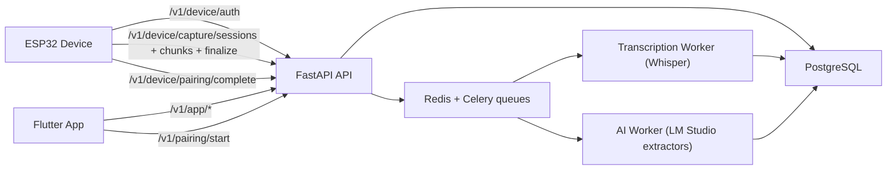
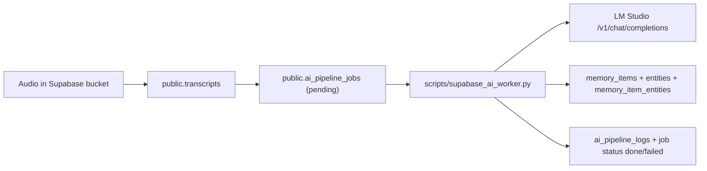

# CortX / SecondMind

CortX (SecondMind) is a voice-memory system that captures speech from ESP32 or phone, stores audio + transcript, structures it into actionable intelligence, and serves it back in a mobile app.

This README documents what is implemented right now across:
- Backend (`FastAPI + PostgreSQL + Redis + Celery + MinIO`)
- Flutter app (`flutterapp/AIDevice`)
- Firmware (`ESP32-S3 Sense`, BLE pairing + audio capture)
- Supabase AI pipeline (`Supabase + LM Studio worker`)

---

## 1) Current System At A Glance

There are **two working backend paths** in this repo:

1. **FastAPI stack (primary API platform in repo)**
   - Device/app auth
   - BLE pairing token exchange
   - Capture session/chunk ingestion
   - WAV upload ingestion
   - Transcription + AI extraction workers
   - App APIs for captures, AI cards, memory links, idea graph, founder intelligence

2. **Supabase AI memory pipeline (MVP track)**
   - Audio + transcript stored in Supabase
   - Job queue table in Supabase
   - Python worker (`scripts/supabase_ai_worker.py`) calls LM Studio
   - Structured outputs persisted in Supabase memory tables
   - SQL RPCs for tasks/ideas/discussions/daily summary

Both tracks exist because product and team experimentation moved quickly (device direct, phone gateway, and Supabase-only AI phases).

---

## 2) High-Level Architecture

### 2.1 FastAPI Platform Flow



### 2.2 Supabase AI Pipeline Flow



---

## 3) Repository Structure

```text
/Users/sujeetkumarsingh/Desktop/CortX
├── app/                       # FastAPI backend, DB models, services, workers
├── docs/                      # API contracts, runbooks, flow docs, SQL migrations
├── firmware/
│   └── arduino_ide/
│       ├── SecondMindESP32S3/             # BLE live audio gateway sketch
│       └── SecondMindESP32S3BackendDB/    # direct backend chunk upload sketch
├── flutterapp/AIDevice/       # Flutter mobile app (Riverpod + Dio + BLE)
├── scripts/
│   ├── supabase_ai_worker.py  # Supabase -> LM Studio -> structured memory
│   └── download_whisper_model.py
├── supabase/sql/
│   └── 001_ai_memory_mvp.sql  # Supabase schema + RPCs + triggers
└── docker-compose.yml
```

---

## 4) Backend (FastAPI) - Implemented Features

Base prefix: `/v1`

### 4.1 Health
- `GET /v1/health`
- `GET /v1/health/ai-metrics`

### 4.2 Device Identity + Session
- `POST /v1/device/register` (admin-key protected)
- `POST /v1/device/auth` (returns device JWT)
- `POST /v1/device/heartbeat`

### 4.3 Pairing (BLE + Backend Claim Flow)
- `POST /v1/pairing/start` (app-auth)
- `POST /v1/device/pairing/complete` (device-auth)
- `GET /v1/device/pairing/status`

Implements:
- one-time short-lived pair token
- token hash storage (`pairing_sessions`)
- conflict handling for already-paired devices
- durable device-user binding (`device_user_bindings`)

### 4.4 Device Capture Ingestion
- `POST /v1/device/capture/sessions`
- `POST /v1/device/capture/chunks`
- `POST /v1/device/capture/sessions/{id}/finalize`
- `POST /v1/device/captures/upload-wav` (compat route)

Implements:
- chunk ordering checks
- duplicate chunk handling (idempotent response)
- sequence ACK/next expectations
- final assembly to WAV (`audio_blob_wav` in DB)
- enqueue to transcription queue

### 4.5 App Auth + Profile + Account
- `POST /v1/app/register`
- `POST /v1/app/auth`
- `POST /v1/app/password/forgot/request`
- `POST /v1/app/password/forgot/confirm`
- `GET /v1/app/me`, `PATCH /v1/app/me`
- avatar APIs: `GET/PUT/DELETE /v1/app/me/avatar`
- preferences APIs: `GET/PATCH /v1/app/me/preferences`
- account deletion: `POST /v1/app/me/delete`

### 4.6 App Device Management
- `GET /v1/app/devices`
- `PATCH /v1/app/devices/{device_id}`
- `DELETE /v1/app/devices/{device_id}`
- `POST /v1/app/devices/{device_id}/network-profile`

### 4.7 App Capture + Memory Consumption
- `POST /v1/app/captures/upload-wav`
- `GET /v1/app/captures`
- `GET /v1/app/captures/{session_id}/audio`
- `GET /v1/app/captures/{session_id}/transcript`
- `GET /v1/app/captures/{session_id}/ai`
- `POST /v1/app/captures/{session_id}/ai/reprocess`

### 4.8 Memory Search + Semantic Query
- `GET /v1/app/memories/search`
- `POST /v1/app/memories/ask`

### 4.9 Assistant Items + Daily Summary
- `GET /v1/app/assistant/items`
- `PATCH /v1/app/assistant/items/{item_id}`
- `GET /v1/app/dashboard/daily-summary`

### 4.10 Linking + Graph + Founder OS APIs
- Capture link APIs:
  - `GET/POST/PATCH/DELETE /v1/app/captures/{session_id}/links...`
  - `GET /v1/app/link-targets/search`
- Idea graph APIs:
  - `GET /v1/app/idea-graph`
  - `GET /v1/app/idea-graph/entities/{entity_id}`
  - `GET /v1/app/idea-graph/entities/{entity_id}/mentions`
- Founder intelligence APIs:
  - `GET /v1/app/founder/ideas`
  - `GET /v1/app/founder/ideas/{idea_id}`
  - `GET /v1/app/founder/signals`
  - `GET /v1/app/founder/weekly-memo`
  - `PATCH /v1/app/founder/actions/{action_id}`

---

## 5) Backend Data Model (FastAPI Stack)

Core tables:
- `app_users`, `app_user_preferences`, `app_password_reset_tokens`
- `devices`
- `device_user_bindings`, `pairing_sessions`
- `capture_sessions`, `audio_chunks`, `transcripts`, `transcript_segments`
- `ai_extractions`, `ai_items`
- `entities`, `entity_mentions`
- `memory_links`
- `founder_idea_clusters`, `founder_idea_memories`, `founder_idea_actions`, `founder_signals`, `weekly_founder_memos`

`capture_sessions.status` lifecycle:
- `receiving -> queued -> transcribing -> done | failed`

---

## 6) Worker Pipelines (FastAPI Stack)

### 6.1 Transcription Worker
Task: `app.workers.tasks.process_session_transcription`
- reads finalized WAV from `capture_sessions.audio_blob_wav`
- runs whisper transcription (`app/services/transcriber.py`)
- writes transcript + segments
- sets fallback `memory_title` and `memory_gist`
- queues AI extraction

### 6.2 AI Extraction Worker
Task: `app.workers.tasks.process_session_ai_extraction`
- calls LM Studio via assistant extractor
- writes `ai_extractions` + `ai_items`
- generates memory card title/gist
- runs entity extraction and persists mentions
- queues founder intelligence pipeline

### 6.3 Founder Intelligence Worker
Task: `app.workers.tasks.process_session_founder_intelligence`
- clusters startup ideas across sessions
- emits signals and action candidates
- updates weekly founder memo

### 6.4 Recovery Task
Task: `app.workers.tasks.recover_stale_sessions`
- requeues stale transcribing sessions
- helps reliability for long-run deployments

---

## 7) Flutter App (`flutterapp/AIDevice`) - Implemented Features

Tech stack:
- Flutter + Riverpod
- Dio for HTTP
- `flutter_blue_plus` for BLE
- `record` for on-phone WAV capture

### 7.1 Authentication + Account
- Sign up, login
- Forgot password request/confirm
- Profile fetch/update
- Avatar upload/download/delete
- Preferences update
- Account delete

### 7.2 Pairing UX
- BLE scan + filter for SecondMind/ESP devices
- Connect + read `device_info` and `pair_nonce`
- Call backend `/v1/pairing/start`
- Write returned `pair_token` back via BLE char
- Listen for `pair_status`
- Poll `/v1/app/devices` until confirmed

### 7.3 Workspace / Hub
- Daily snapshot card from `/v1/app/dashboard/daily-summary`
- Assistant queue (open items)
- Memory board (captures list)
- Pull-to-refresh + error handling

### 7.4 Memory Features
- Capture list
- Audio playback via `/v1/app/captures/{id}/audio`
- Transcript view
- AI detail view
- Memory search (`/v1/app/memories/search`)
- Memory ask (`/v1/app/memories/ask`)

### 7.5 Idea Graph + Founder Screens
- Idea graph visual data from `/v1/app/idea-graph`
- Entity detail + mentions timeline
- Founder ideas/signals/memo views

### 7.6 Device Screen
- list paired devices
- alias update
- unpair action
- online/offline status view

### 7.7 On-Phone Recording Upload
`app_audio_service.dart` implements:
- local WAV recording (16kHz mono)
- upload to `/v1/app/captures/upload-wav`
- status notifier: idle/recording/uploading

---

## 8) Firmware - Implemented Ecosystem

There are two Arduino sketches:

### 8.1 `SecondMindESP32S3.ino` (BLE phone gateway mode)
Path: `firmware/arduino_ide/SecondMindESP32S3/SecondMindESP32S3.ino`

Implements:
- device auth to backend (`/v1/device/auth`)
- BLE pairing service + characteristics
- pair token write callback and pairing completion call
- live PDM capture from onboard mic (`GPIO 42/41`)
- BLE audio packet notifications to phone
- serial commands (`p`, `s`, `t`, `u`, `x`, `h`)

### 8.2 `SecondMindESP32S3BackendDB.ino` (direct backend upload mode)
Path: `firmware/arduino_ide/SecondMindESP32S3BackendDB/SecondMindESP32S3BackendDB.ino`

Implements:
- BLE pairing same contract
- direct session/chunk/finalize uploads to backend
- ping-pong chunk buffering + uploader task
- retry logic + finalization control
- serial commands for start/stop/finalize/test

### 8.3 Arduino Setup Guide
See: `firmware/arduino_ide/SecondMindESP32S3/README_ARDUINO.md`

---

## 9) BLE Pairing Contract (Implemented)

Service UUID:
- `8b6ad1ca-c85d-4262-b1f6-85e134fdb2f0`

Pairing characteristics:
- `device_info` (READ)
- `pair_nonce` (READ)
- `pair_token` (WRITE)
- `pair_status` (READ/NOTIFY)

Optional audio characteristics (gateway mode):
- `audio_control` (WRITE)
- `audio_data` (NOTIFY)
- `audio_state` (READ/NOTIFY)

### Pairing lifecycle
1. ESP enters pairing mode + advertises service.
2. App reads `device_info` + `pair_nonce`.
3. App calls `POST /v1/pairing/start`.
4. Backend returns short-lived `pair_token`.
5. App writes token to ESP `pair_token` char.
6. ESP calls `POST /v1/device/pairing/complete` with device JWT.
7. Backend creates/updates `device_user_bindings`.
8. ESP notifies `pair_status=success`.

---

## 10) Supabase AI Pipeline (MVP)

Files:
- SQL schema/RPC: `supabase/sql/001_ai_memory_mvp.sql`
- Worker: `scripts/supabase_ai_worker.py`
- Runbook: `docs/supabase_ai_pipeline_runbook.md`
- System flow doc: `docs/ai_pipeline_system_flow.md`

### 10.1 What it does
- Enqueues transcript rows into `ai_pipeline_jobs`
- Worker claims pending job via RPC
- Sends transcript text to LM Studio
- Parses strict JSON extraction (`tasks/ideas/decisions/reminders/entities`)
- Writes `memory_items`, `entities`, `memory_item_entities`
- Marks job `done` or `failed`
- Writes logs into `ai_pipeline_logs`

### 10.2 Supabase tables in this track
- `transcripts`
- `ai_pipeline_jobs`
- `ai_pipeline_logs`
- `memory_items`
- `entities`
- `memory_item_entities`
- `daily_summaries`

### 10.3 RPC query layer implemented
- `api_memory_tasks(...)`
- `api_memory_ideas(...)`
- `api_memory_discussions(...)`
- `fn_daily_summary_v1(...)`

---

## 11) Local Development

### 11.1 FastAPI stack (Docker)

```bash
cd /Users/sujeetkumarsingh/Desktop/CortX
cp .env.example .env
# fill required values in .env

docker compose up -d --build api worker postgres redis minio nginx
```

Health checks:

```bash
curl http://localhost:8000/v1/health
curl http://localhost:8000/v1/health/ai-metrics
```

### 11.2 Flutter app

```bash
cd /Users/sujeetkumarsingh/Desktop/CortX/flutterapp/AIDevice
flutter pub get
flutter run
```

### 11.3 Firmware (Arduino IDE)

- Board: `XIAO_ESP32S3`
- Enable PSRAM where required
- Update config values in selected sketch:
  - Wi-Fi
  - `API_BASE_URL`
  - `DEVICE_CODE`
  - `DEVICE_SECRET`

### 11.4 Supabase AI worker

```bash
cd /Users/sujeetkumarsingh/Desktop/CortX
export SUPABASE_URL="https://<project>.supabase.co"
export SUPABASE_SERVICE_ROLE_KEY="<service_role_key>"
export LM_STUDIO_BASE_URL="http://127.0.0.1:1234/v1"
export LM_STUDIO_MODEL="dolphin3.0-llama3.1-8b"
python3 scripts/supabase_ai_worker.py
```

---

## 12) End-to-End Testing Checklist

### 12.1 Pairing
1. Register/login from Flutter app.
2. Put ESP in pairing mode.
3. Start scan and pair in app.
4. Verify `GET /v1/app/devices` shows paired device.

### 12.2 Capture + Transcript + AI (FastAPI)
1. Start device capture (direct backend sketch) or app WAV capture.
2. Confirm session appears in `/v1/app/captures`.
3. Confirm transcript endpoint returns text.
4. Confirm AI endpoint returns extraction + items.

### 12.3 Supabase AI pipeline
1. Ensure transcript rows are inserted into `public.transcripts` with `user_id`.
2. Check `ai_pipeline_jobs` transitions: `pending -> processing -> done`.
3. Verify memory rows in `memory_items` and linked entities.

---

## 13) Security Notes (Important)

Current state in local/dev has used hard-coded secrets during rapid testing. For production:

- Never ship service-role keys in firmware or app binaries.
- Keep `SUPABASE_SERVICE_ROLE_KEY` server/worker-only.
- Keep admin bootstrap key server-side only.
- Rotate any keys already exposed in commits/screenshots/testing logs.
- Use private storage buckets for user audio.
- Enforce per-user access control in APIs and DB policies.

---

## 14) Known Caveats / Technical Debt

- Multiple ingestion modes coexist (gateway, direct backend, Supabase-only), so operational path must be explicitly chosen per deployment.
- Some older docs mention deprecated live stream endpoints; use `docs/api_contract_v1_freeze.md` as canonical contract for current backend routes.
- `app/api/v1/stream.py` exists but is not wired into `app/api/v1/router.py`.
- Flutter branch quality can vary by branch; run `flutter analyze` + app smoke tests before releases.

---

## 15) Key Documentation Index

- API contract freeze: `docs/api_contract_v1_freeze.md`
- IoT pairing guide: `docs/iot_pairing_guide.md`
- App pairing flow: `docs/app_pairing_api_flow.md`
- BLE phone gateway flow: `docs/ble_phone_gateway_flow.md`
- FastAPI DB migrations:
  - `docs/postgres_audio_storage_migration.sql`
  - `docs/postgres_ai_assistant_migration.sql`
  - `docs/postgres_daily_summary_profile_device_migration.sql`
  - `docs/postgres_founder_intelligence_migration.sql`
  - `docs/postgres_memory_search_linking_migration.sql`
- Supabase AI runbook: `docs/supabase_ai_pipeline_runbook.md`
- Supabase AI flow: `docs/ai_pipeline_system_flow.md`

---

## 16) Product Direction Snapshot

SecondMind/CortX is positioned as a personal cognitive operating system:
- capture thoughts with minimal friction
- convert unstructured speech to structured memory
- track tasks, ideas, decisions, reminders, entities
- connect memory over time (graph + founder intelligence)
- expose actionable summaries in the app

This repository already contains the core primitives for that MVP: pairing, capture, transcript, extraction, memory storage, query APIs, and app surfaces.

