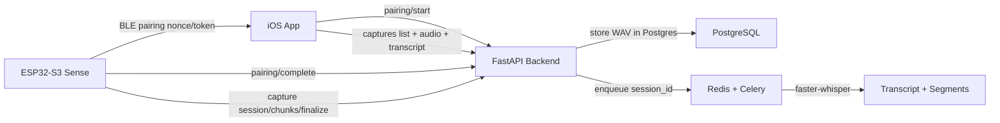

# REDBY — Build Tracker & Context (SecondMind)

Updated: 2026-04-03

## What This Project Is
SecondMind is an ESP32 + iOS + backend system for paired-device voice capture, backend storage, local transcription, and app playback.

## Current End-to-End Flow

## Implementation Tracker

| Area | Feature | Status | How It Works |
|---|---|---|---|
| Firmware | BLE pairing mode (`p`) + token write flow | Done | ESP32 advertises pairing service, app writes short-lived pair token, backend binding completes. |
| Firmware | Continuous chunk capture (ping-pong buffers) | Done | Two PSRAM buffers: one records while previous chunk uploads. |
| Firmware | Backend direct chunk API upload | Done | Uses `/v1/device/capture/sessions`, `/chunks`, `/finalize`. |
| Firmware | Auto rolling finalize | Done | Session auto-finalizes after configured chunk count, then starts next session. |
| Firmware | Wi-Fi reconnect stabilization | Done | Prevents repeated `WiFi.begin()` while station is already connecting. |
| Backend | Chunk session ingest APIs | Done | Strict sequence ingest with duplicate/out-of-order protection. |
| Backend | Finalize -> WAV assembly -> queue transcription | Done | Assembles chunks to WAV, stores in DB, queues Celery task. |
| Backend | Finalize idempotency | Done | Repeated finalize on queued/transcribing/done is safe. |
| Backend | App audio playback API | Done | `GET /v1/app/captures/{id}/audio` streams WAV bytes from DB. |
| Backend | Local transcription worker (faster-whisper) | Done | Worker processes queued sessions and writes transcript + segments. |
| Backend | Transcription retries/backoff | Done | Failed STT retries with exponential backoff before final fail. |
| Backend | Recovery for stale transcribing sessions | Done | Worker startup requeues stale/pending sessions. |
| Backend | Self-hosted Whisper model path support | Done | `WHISPER_MODEL_PATH` can point to local downloaded model directory. |
| Backend | Whisper model download utility | Done | `scripts/download_whisper_model.py` downloads official `Systran/faster-whisper-*` locally. |
| Backend | LM Studio AI extraction worker | Done | Auto extracts intent/plan/tasks/reminders after transcript completion. |
| Backend | Assistant DB + APIs | Done | `ai_extractions`, `ai_items`, and app APIs for list/update/reprocess. |
| Infra | Persistent model/cache volumes | Done | Docker volumes for HuggingFace cache and local whisper model files. |
| iOS App | Device pairing UI | Done | Pair sheet scans, reads nonce, requests pair token, writes token to ESP32. |
| iOS App | Saved audio list + playback | Done | Lists capture sessions and plays WAV from backend API. |
| iOS App | Transcript UI integration | Done | Dashboard can load transcript per capture and show inline transcript text + metadata. |
| iOS App | Auto refresh captures | Done | Dashboard polls captures periodically for near-live updates. |
| iOS App | Assistant UI + item actions + Calendar export | Done | Shows intent/plan/tasks/reminders, updates status, and exports reminders to Apple Calendar. |

## Data Model (Current)

| Table | Purpose | Link |
|---|---|---|
| `capture_sessions` | One logical audio session per finalized upload | parent |
| `audio_chunks` | Raw PCM chunks per session | `audio_chunks.session_id -> capture_sessions.id` |
| `transcripts` | One transcript row per session | `transcripts.session_id -> capture_sessions.id` (unique) |
| `transcript_segments` | Time-aligned segment rows | `transcript_segments.transcript_id -> transcripts.id` |
| `ai_extractions` | Per-transcript AI output status + intent/summary/plan | `ai_extractions.transcript_id -> transcripts.id` (unique) |
| `ai_items` | Actionable task/reminder/plan-step items | `ai_items.extraction_id -> ai_extractions.id` |

## API Contract Direction
Primary capture contract now:
- `POST /v1/device/capture/sessions`
- `POST /v1/device/capture/chunks`
- `POST /v1/device/capture/sessions/{session_id}/finalize`

Compatibility route still present:
- `POST /v1/device/captures/upload-wav`

Assistant contract added:
- `GET /v1/app/captures/{session_id}/ai`
- `POST /v1/app/captures/{session_id}/ai/reprocess`
- `GET /v1/app/assistant/items`
- `PATCH /v1/app/assistant/items/{item_id}`

## Firmware Runtime Notes
- Current chunk payload is constrained to backend limit (now effectively ~8s at 16k mono PCM16 when max is 256000 bytes).
- Rolling finalize is enabled to auto-send finalized audio blobs without manual `s`.

## How To Operate (Quick)
1. Pair device from app (BLE pairing flow).
2. Let firmware stream chunks.
3. Firmware auto-finalizes each rolling session.
4. App sees capture entries, plays audio, and transcript appears after worker completes.
5. In app, tap `Load Text` on a capture to fetch transcript on demand (or wait for auto refresh/prefetch on done sessions).

## Latest Milestones (2026-04-03)
- Local self-hosted Whisper model enabled and verified from path: `/models/faster-whisper-small`.
- Worker prewarm, retry/backoff, and stale transcribing recovery implemented.
- Dashboard transcript flow implemented and compiled successfully:
  - load transcript button
  - inline text rendering
  - not-ready handling for in-progress transcription.

## What Is Next
- Add explicit health/metrics endpoint for transcription queue depth + worker latency.
- Add admin endpoint for manual transcription requeue by session id.
- Add per-device/session retention policy for chunk cleanup after transcript completion.
- Add transcription quality controls (language hint, beam size mode, VAD tuning).

## Useful Files
- `app/api/v1/device.py`
- `app/services/capture_finalize.py`
- `app/workers/tasks.py`
- `app/workers/celery_app.py`
- `app/services/transcriber.py`
- `firmware/arduino_ide/SecondMindESP32S3BackendDB/SecondMindESP32S3BackendDB.ino`
- `CortxApp/CortxApp/Views/DashboardView.swift`
- `docs/api_contract_v1_freeze.md`
