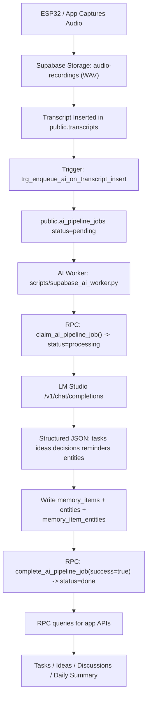
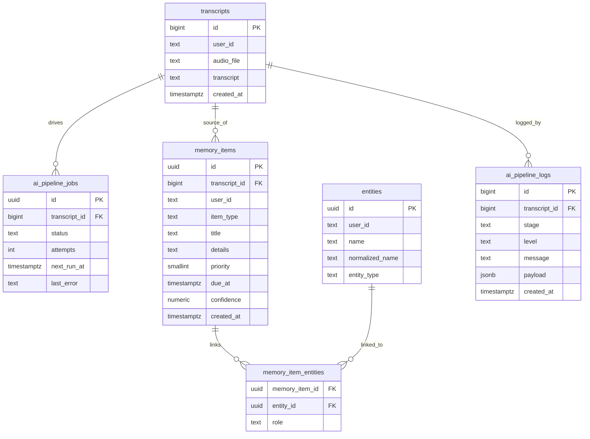

# SecondMind AI Pipeline Flow (Current Build)

This document explains exactly what is built right now and how the full flow works from audio upload to AI-structured memory.

## 1) What Is Built Right Now

1. Audio files are uploaded to Supabase Storage bucket: `audio-recordings`.
2. Transcript rows are stored in `public.transcripts`.
3. AI job queue is stored in `public.ai_pipeline_jobs`.
4. Python worker (`scripts/supabase_ai_worker.py`) polls pending jobs.
5. Worker sends transcript text to LM Studio (`/v1/chat/completions`).
6. Worker parses strict JSON output (`tasks`, `ideas`, `decisions`, `reminders`, `entities`).
7. Worker writes structured memory into:
   - `public.memory_items`
   - `public.entities`
   - `public.memory_item_entities`
8. Job status is marked `done` or `failed`.
9. Query RPCs return structured data for app/backend APIs:
   - `api_memory_tasks(...)`
   - `api_memory_ideas(...)`
   - `api_memory_discussions(...)`
   - `fn_daily_summary_v1(...)`

## 2) End-to-End Runtime Flow



## 3) LM Studio: What It Is Doing

LM Studio is used as the extraction engine, not storage.

1. Worker reads transcript text from `public.transcripts`.
2. Worker sends prompt to LM Studio model (OpenAI-compatible endpoint).
3. LM Studio returns JSON extraction:
   - `tasks[]`
   - `ideas[]`
   - `decisions[]`
   - `reminders[]`
   - `entities[]`
4. Worker validates and normalizes the JSON.
5. Worker writes normalized output into Supabase tables.

Important: LM Studio does not write to DB directly. Worker controls all DB writes.

## 4) Tables and Their Purpose

### Source Tables

1. `public.transcripts`
   - Source transcript text per audio file/session.
   - Includes metadata like `audio_file`, `bucket`, `created_at`, and `user_id`.
2. `public.transcriptions` (legacy/optional)
   - Older table; can be kept or retired based on your migration plan.

### AI Pipeline Tables

1. `public.ai_pipeline_jobs`
   - Queue state machine: `pending | processing | done | failed`.
   - Retry fields: `attempts`, `next_run_at`, `last_error`.
2. `public.ai_pipeline_logs`
   - Observability logs per stage (`claim`, `extract`, `save`, `error`).

### Memory Tables (AI Output)

1. `public.memory_items`
   - Core extracted items.
   - `item_type`: `task | idea | decision | reminder`
   - fields: `title`, `details`, `priority`, `due_at`, `confidence`, source references.
2. `public.entities`
   - Normalized entities like person/project/topic/time.
3. `public.memory_item_entities`
   - Many-to-many links between memory items and entities.
4. `public.daily_summaries`
   - Cached summary JSON per user/day (optional cache table).

## 5) Data Model Diagram



## 6) Query Layer (Already Created)

Use these RPC functions:

1. Tasks:
```sql
select * from public.api_memory_tasks('lodu@gmail.com', 'open', 20);
```

2. Ideas (last N days):
```sql
select * from public.api_memory_ideas('lodu@gmail.com', 7, 20);
```

3. Discussions with person:
```sql
select * from public.api_memory_discussions('lodu@gmail.com', 'Aman', 30, 20);
```

4. Daily summary:
```sql
select public.fn_daily_summary_v1('lodu@gmail.com'::text);
```

## 7) Operational Status Checks

1. Queue progress:
```sql
select status, count(*) from public.ai_pipeline_jobs group by status order by status;
```

2. Extracted output volume:
```sql
select count(*) as memory_items from public.memory_items;
select count(*) as entities from public.entities;
```

3. Recent pipeline logs:
```sql
select created_at, stage, level, message, payload
from public.ai_pipeline_logs
order by created_at desc
limit 50;
```

## 8) Full Reset for Fresh End-to-End Testing

If you want a clean test run after deleting bucket files:

```sql
begin;

truncate table
  public.memory_item_entities,
  public.memory_items,
  public.entities,
  public.daily_summaries,
  public.ai_pipeline_logs,
  public.ai_pipeline_jobs,
  public.transcriptions,
  public.transcripts
restart identity cascade;

commit;
```

Then run one fresh recording/transcript and verify pipeline moves:

`pending -> processing -> done`

